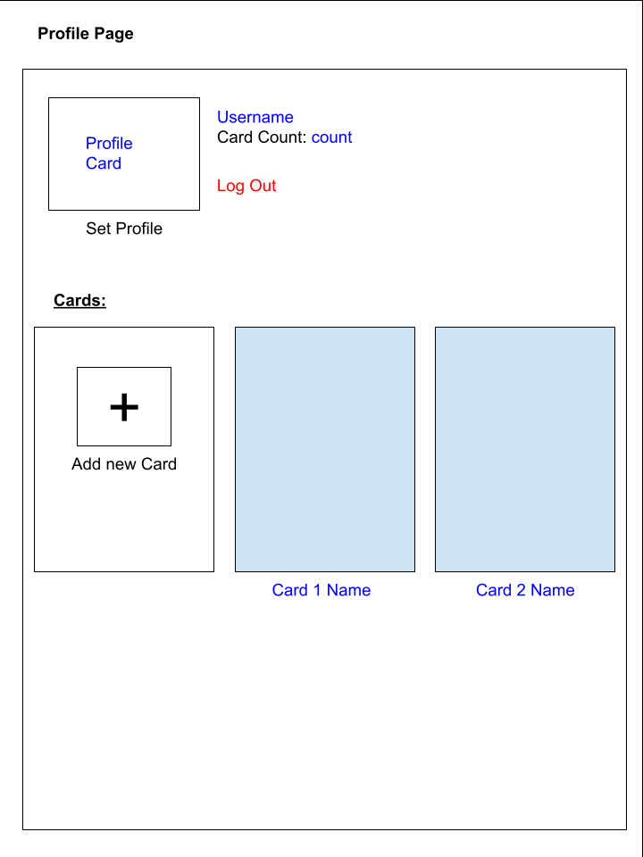
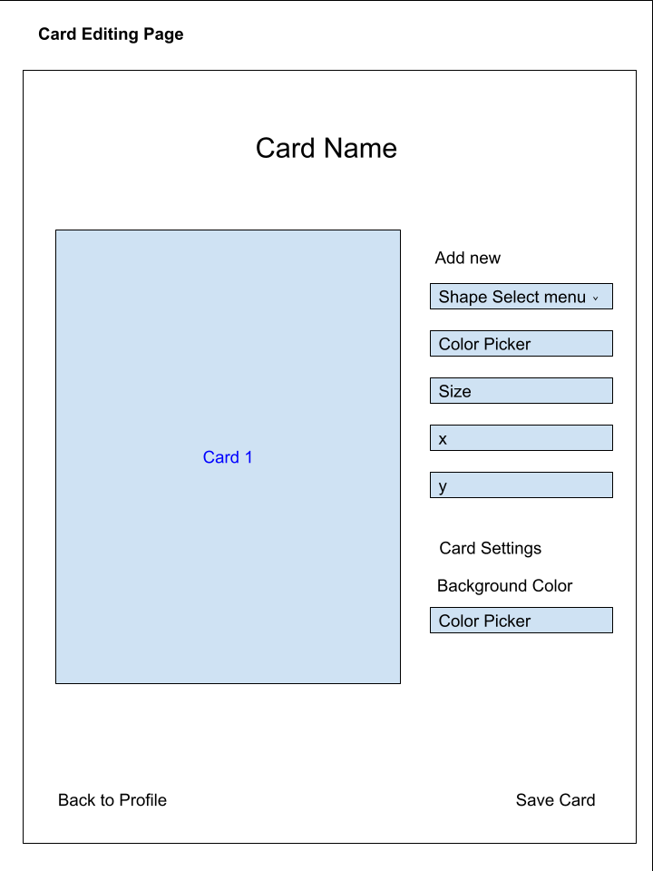
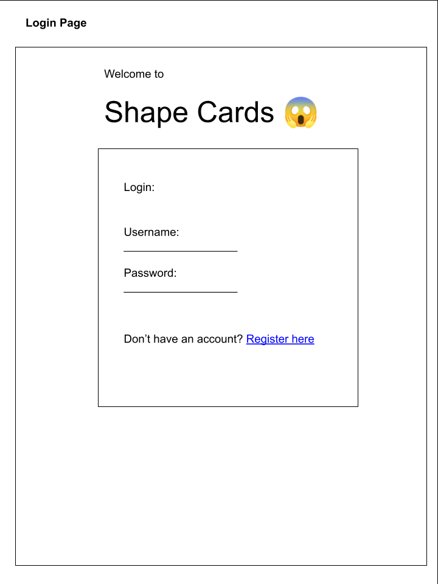
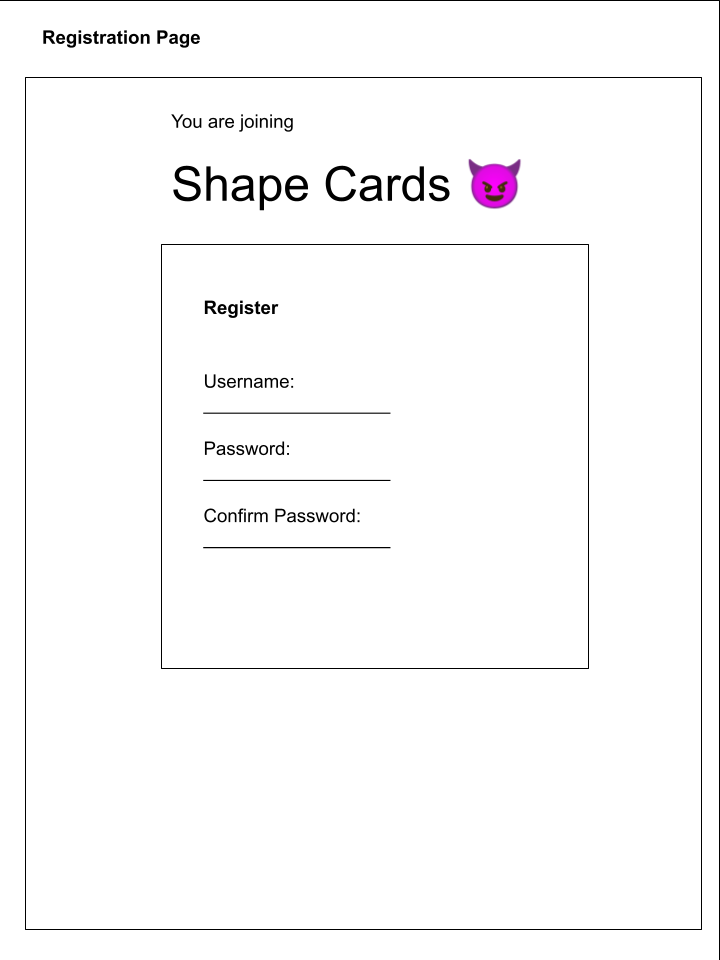

The content below is an example project proposal / requirements document. Replace the text below the lines marked "__TODO__" with details specific to your project. Remove the "TODO" lines.

# ShapeCards

## Overview

Can't seem to remember your favorite color and shapes? Want to create and save a cool graphic?

ShapeEditor is a web app that will allow users to create cards filled with their favorite shape and color. Users can register and login. Once they're logged in, they can modify their favorite drawing by adding multiple shapes and colors, along with it's size and position.

## Data Model

The application will store Users, Cards and Items

* users can have multiple cards (via references)
* each card can have multiple shapes (by embedding)
* card can be used as profile pic

An Example User:

```javascript
{
  username: "bobRoss",
  hash: // a password hash,
  Cards: // an array of references to card documents
  profilePicIndex: //index of card to be used as profile picture
}
```

An Example Card with Embedded Shapes:

```javascript
{
  user: // a reference to a User object
  name: "Design 1",
  background-color: "white",
  //colors are in hex
  shapes: [
    { type: "square", color: "000000", size: "30", xpos: "50", ypos: "50"},
    { type: "cirlce", color: "0F3A5C", size: "17" , xpos: "20", ypos: "70"},
  ],
  createdAt: // timestamp
}
```


## [Link to Commented First Draft Schema](db.mjs) 

(__TODO__: create a first draft of your Schemas in db.mjs and link to it)

## Wireframes

/cards - profile page that shows all cards



/cards/edit - page for creating and editing cards



/login - page for logging in



/register - page for registering


## Site map


## User Stories or Use Cases

1. as non-registered user, I can register a new account with the site
2. as a user, I can log in to the site
3. as a user, I can create a new card
4. as a user, I can view all of my cards in a list
5. as a user, I can edit an existing card
6. as a user, I can set a profile pic using an existing card

## Research Topics

(__TODO__: the research topics that you're planning on working on along with their point values... and the total points of research topics listed)

* (5 points) Integrate user authentication
    * I'm going to be using passport for user authentication
    * And account has been made for testing; I'll email you the password
* (3 points) Canvas API
    * HTML/Javascript to actually create the cards using the canvas library
* (2 points) Tailwind
    * CSS framwework
* (6 points) Vue.js
    * 6 points as listed in the documentation

16 points total out of 8 required points


## [Link to Initial Main Project File](app.mjs) 

(__TODO__: create a skeleton Express application with a package.json, app.mjs, views folder, etc. ... and link to your initial app.mjs)

## Annotations / References Used

(__TODO__: list any tutorials/references/etc. that you've based your code off of)

1. [passport.js authentication docs](http://passportjs.org/docs) - (add link to source code that was based on this)
2. [tutorial on vue.js](https://vuejs.org/v2/guide/) - (add link to source code that was based on this)

