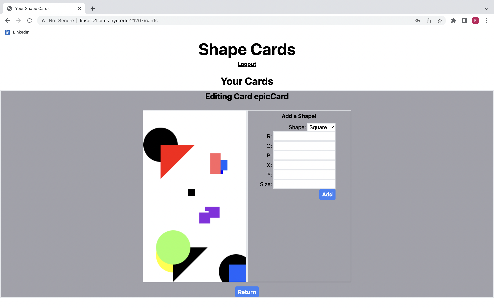

# ShapeCards
### Hosted on: http://linserv1.cims.nyu.edu:21207
## Overview

Can't seem to remember your favorite color and shapes? Want to create and save a cool graphic?

ShapeEditor is a web app that will allow users to create cards filled with their favorite shape and color. Users can register and login. Once they're logged in, they can modify their cards by adding multiple shapes and colors, along with its position.

ShapeEditor is like the new Photoshop, except you can't change the background color, can't edit previously added shapes, upload images to edit, or use any other functional tool that Photoshop provides. (Basically it's a better Photoshop)

## Data Model

The application will store Users and Cards

* users can have multiple cards (via references)
* each card can have multiple shapes (by embedding)
* card can be used as profile pic

An Example User:

```javascript
{
  username: "bobRoss",
  password: // a password hash,
}
```

An Example Card with Embedded Shapes:

```javascript
{
  userId: // a reference to a User object
  name: "Design 1",
  background-color: {r: "127", g: "127", b: "127"},
  //colors are in hex
  shapes: [
    { type: "square", pos: {x: "50", y: "50"}, color: {r: "127", g: "127", b: "127"}},
    { type: "circle", pos: {x: "20", y: "70"}, color: {r: "127", g: "127", b: "127"}},
  ],
  size: "27",
  createdAt: // timestamp
}
```

## [Link to Commented Schema](db.mjs) 

## Wireframes
/ - home page with hyperlinks to profile, login, and registration pages


/login - page for logging in


/register - page for registering


/cards - profile page that shows all cards as well as an editor

View Cards

Card Editor


## Site map


## User Stories or Use Cases

1. as non-registered user, I can register a new account with the site
2. as a user, I can log in to the site
3. as a user, I can view all of my cards in a list
4. as a user, I can create a new card
5. as a user, I can edit an existing card
5. as a user, I can delete an existing card

## Research Topics
* (5 points) Integrate user authentication
    * I'm going to be using passport for user authentication
    * You can simply register a new account
    * See http://linserv1.cims.nyu.edu:21207/register for registration page
    * See http://linserv1.cims.nyu.edu:21207/login for login page
* (3 points) Canvas API
    * HTML/Javascript to actually create the cards using the canvas library
* (2 points) Tailwind
    * CSS framwework
    
10 points total out of 8 required points


## [Link to Main Project Server File](app.mjs) 

## Annotations / References Used

(__TODO__: list any tutorials/references/etc. that you've based your code off of)

1. [passport.js authentication docs](http://passportjs.org/docs)
3. [passport.js express tutorial](https://heynode.com/tutorial/authenticate-users-node-expressjs-and-passportjs/)
3. [tailwind documentation](https://tailwindcss.com/docs)

